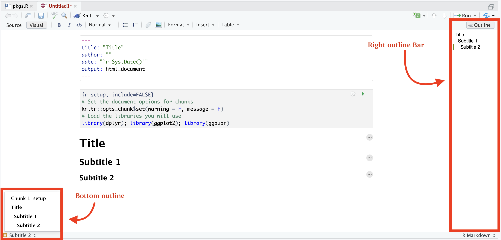

```{r setup, include=FALSE}
knitr::opts_chunk$set(warning = F, message = F)
library(dplyr); library(ggplot2); library(ggpubr);library(Pabloverse)
```

<em>
[Switch to english  {width="25"}](https://www.spablo-temporal.network/DataViz-workshop/0a_Intro_RstudioMarkdown.html) | [Mudar para Portugues  {width="25"}](https://www.spablo-temporal.network/DataViz-workshop/PT/0a_Intro_RstudioMarkdown.html)
</em>

In this first section we are not going to worry at all about coding or the syntax used in R, we will focus on familiarizing with the Rstudio interface and what kind of files we can create with it.

The goal of this lab is that, by the end, you feel more comfortable with the following concepts:

-   Project organization.
-   The main components of the Rstudio interface.
-   Files you can create with Rstudio.

For this workshop you can use R studio or posit cloud. R studio runs locally in your computer, 

# The Rstudio interface

When we start R studio, we can see 4 sections:

1.  **Source** (top left), here we have our code editor and other files. We will use this section to edit and view our scripts and other documents we will be using to interact with R.
2.  **Console and Terminal** (bottom left), this is where the code is executed (*Console* will execute R code and *Terminal* other code for your operating system). We can directly write the code here, but normally we will be using the other source files such as .R or .Rmd to write our code which then will be send here.\
3.  **Environment, History and others** (top right), Environment will list all the objects you create and History will have the code you sent to the console. There are other tabs in this section which we wont be using for now.
4.  **Files, Packages and Help** (bottom right). This section includes a file browser, and other tabs for package management and help.


# Organizing your projects

One of the most useful features of R studio is the project organization, if you haven, I strongly encourage you to familiarize with creating and using projects to organize your workflow. Projects allow to create a file that will contain all the information regarding your session (including objects, data sets and configurations) and organize your files in folders in your system. This is particularly useful when we are working with multiple topics.\
When you open Rstudio for the first time it starts on an empty project. To create a new project, just go to the top right corner menu and select *New Project...*


Then will give you the option to create a new project in a new directory, un an existing directory or version control. For today, we wont be talking about version control in detail, but this is to integrate Rstudio with Github.


Once you have selected the option that you want, it will show you multiple options for types of projects, you can select *New project* and continue.


Then you just name your directory and select a location.


Once the project is created, in the files tab you will see that Rstudio created the files for your project in the folder that you selected. The project organization depends on your personal preferences, but I usually like to create 3 folders (code, data and docs) to organize my files related with the current project.


# Editors in Rstudio

## R scripts(.R)

We are going to open our first R script. In the [shared folder](https://ucdavis.box.com/s/ztydby6t65nil1oh8elhnogdjisrwgcc) you will find an R script under `Code/pkgs.R`, download it to your computer and we will import it to our R project. Go to the files tab located in the bottom left panel and click on the upload button:

{width="100%"}

A box will pop up with a few options, click on the *Choose file* option and locate the script you downloaded in your computer.

{width="30%"}

Now that you uploaded the file to your project, open in and run the script by clicking on the *Source* button. This will install a few libraries we will be using during the workshop.

{width="100%"}

R scripts are the most common type of file used by the R software, but there are other types of files that will make easier generating documents.

## Intro to Markdown

{style="float:right" width="16%"}

R studio can create several types of documents including: R scripts, text files, Markdown, among others. To create a new document you can go to the menu located at the upper left corner.

A menu will show with all the different document types you can create. For now we will select the option *R Markdown...*.

It might ask you to install a library if it's not already installed, so just click yes if it does. This will open a window where will ask for a Title, author and Date. We will go to the left side menu and select the option from template.


If you installed properly the libraries from the pkgs.R script in the previous step, you will see a template called *blank* from the `STNet` library. This is just an empty template I made. Select the template and click ok. 


## Documents with R Markdown (.Rmd)

We created our first document with R Markdown, and will look like this:


The document has already the header and a code 'chunk' (we will talk more about this later). Add a title for the document and put your name in the author field. The Rmd documents use a syntax called markdown which we will not cover in detail, but you can find more info in [this link](https://www.rstudio.com/wp-content/uploads/2015/02/rmarkdown-cheatsheet.pdf). You can edit the document directly with the Rmd syntax, but if you prefer to save some time and don't have to deal with learning everything from scratch, there is an option to edit the document in a more familiar way. To do this just change the option located in the top right of the document from *Source* to *Visual*. You will notice that a toolbar with some familiar icons appeared at the top.


To add a new section to the document, you might want to start with a title. The titles can be hierarchical similar to what we are used in other text editors (Title, Subtitle 1, Subtitle 2, etc...). To define a new title we use the character `#` in front of the text, and the number of `#` before the text will be the hierarchy level. For example if we want to define a title hierarchy we write:

```         
# Title 1

## Subtitle 1

### Subtitle 2
```

Which in our visual and rendered document will look like this:


### Navigating the document

Having defined sections in our document is nice because we can quickly jump between them. There are 2 ways of quickly navigating between sections: the *outline right bar* and the *bottom outline menu*. If your right outline bar is collapsed, make sure to click on the outline icon {width="10%"}



You will notice that the bottom outline has a few extra sections labeled *Chunk*. A chunk refers to a piece of code in the document. This piece of code will execute (unless you specify the opposite) every time that you document renders. Each document is self contained which means taht all the objects and functions you use must be declared and loaded in order for the document to render properly (we will talk more about this later).

### Rendering the document

Now that we have a document we are going to render it to different formats. To render the document you can either click on the *knit* icon {width="10%"}, or use the shortcut `ctrl+shift+k`. The default format that the document will be rendered is html, but you can choose different formats from the dropdown menu.


## [Exercise 1]{style="color: darkred;"}

Add a new section to your document with a short bio about yourself (background and research interests), and include your favorite song and/or favorite food. Try the different rendering modes (pdf and word), save it as *exercise1_yourName* and submit the document in the following box OR [this link](https://ucdavis.app.box.com/f/821be3f5e59b4924ac20ea639246cc31).

<iframe src="https://ucdavis.app.box.com/f/1018d221f1ad42e18e17de4ee5b1d821" height="550" width="800"></iframe>

## Presentations with quarto

Like you saw, R studio can be used for more than just coding. R studio can be used as a free alternative to text editors, which allow us to generate different kind of documents such as reports. But wait... there is more things we can use R studio for, in the next section we will briefly introduce on how to use R studio to generate presentations, similar to something you could achieve with power point.

Quarto is a platform for creating presentations using a very similar approach as R markdown. To create a quarto presentation you can use the same menu that you previously used to create a new document.


Your presentation will have already some text based on the default template and will look similar to this:


Similar to the R Markdown documents, you can render the presentation in multiple formats. The default format uses html, but you can also render to pdf and power point. If you want to render to other formats you can specify that when creating the document or change that in the YAML header:

For power point:


For pdf:


We are not going to cover in detail how to go beyond the formatting of the presentations, but here are some exaples so you can see the scope:

-   <https://runapp2022.talks.jamesgoldie.dev/#/james-goldie>
-   <https://emilhvitfeldt.github.io/useR2022-textrecipes/#/section-8>

<https://github.com/mcanouil/awesome-quarto#real-life-examples>

------------------------------------------------------------------------

*This lab has been developed with contributions from: [Jose Pablo Gomez-Vazquez](https://www.spablo-temporal.network).\
Feel free to use these training materials for your own research and teaching. When using the materials we would appreciate using the proper credits. If you would be interested in a training session, please contact: [jpgo\@ucdavis.edu](mailto:jpgo@ucdavis.edu){.email}*

------------------------------------------------------------------------
