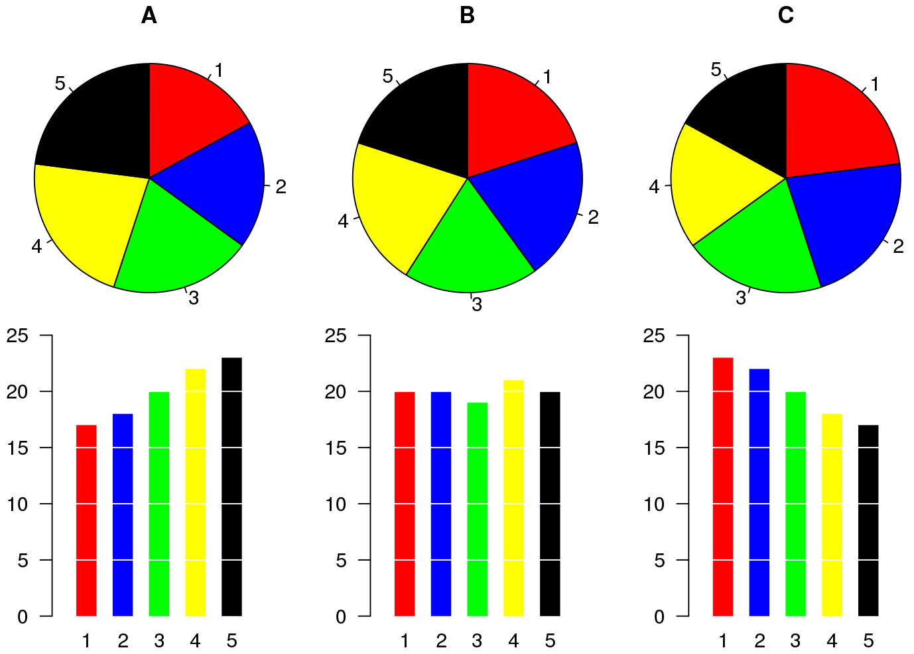

```{r setup, include=FALSE}
knitr::opts_chunk$set(warning = F, message = F)
```

```{r load libraries and data}
# Load the libraries
library(ggplot2) # for graphics
library(dplyr) # For data manipulation
library(STNet) # Library with the data

# loading the data from the package
data('captures') # we load the data
head(captures) # let's have a look at the data
```

# Plots in R

By default R already has a set of functions to create a variety of figures, but the code can get quite complex and difficult to read as we produce more detailed figures. `ggplot2` is a library that provides a set of functions for producing a variety of figures.

The function `ggplot()` has to be called at the beginning of the plot definition, this function sets a blank canvas for our plot. If we call the function with no arguments we will just see the empty canvas, for example:

```{r blank canvas}
ggplot()
```

Then we can add layers to our canvas based on the data we want to visualize, similarly to the pipes, we will connect the different layers of our plot with the operator `+`.

The basic components that we need to define for a plot are the following:

-   *data*, the data set we will use to generate the figure
-   *geometry*, or type of graphic we will generate (i.e. histogram, bar, scatter, etc..)
-   *aesthetic*, variables or arguments that will be used for the figure for example: location, color, size, etc..

An example:

```{r hist example}
ggplot(data = captures) + # This is the data we will use
  geom_histogram( # This is the geometry 
    aes(x = treated) # The aesthetic includes only one variable representing the x axis
  )
```

Other components of the plots can be defined to further customize our figures, and we will cover those more in detail in future sections.\
As you noticed in the previous example, we can print the figures directly from the R console, but a way I like to organize the figures is to put them all inside a single object in R. This object can be a `list`, which is just a container for other objects.

```{r create fig list}
# To create an empty list we can use the function list()
figures <- list()
```

# Visualizing distributions

## Continous variables

### Histograms

The most simple way to visualize the distribution of a continuous variable is using a histogram. Histograms are a special kind of bar plots where our variable is grouped in bins and showing the counts for each bin. Now that we have our container list for the plots, we can simply save it there and assign a name we want.

Notice that we will combine the pipes with the ggplot syntax. you can either define the name of the data in the ggplot function or before the function and connect it with a pipe.

```{r hist}
figures$histogram <- captures %>% # This is the data we use.
  ggplot() + # we set the empty canvas
  geom_histogram(aes(x = treated)) # add a layer to visualize a histogram

# we can see our plot by calling the name in our container list
figures$histogram
```

### Boxplots

Box plots are great to show the distribution of a continuous variable. We can use it to show only one variable, or multiple variables. It is important to be very descriptive when making plots, the idea of a figure is that can explain itself. we will start to slowly introduce functions to do this and customize our figures.

```{r boxplot}
# Only one variable
figures$box <- captures %>% 
  ggplot() +
  geom_boxplot(aes(y = treated))

figures$box
```

## Categorical variables

## Pie charts... ?

Pie charts are not very straight forward in ggplot, there is NO geom_pie functions. To do this, you can essentially do a bar chart with some specifications and then use the function `coord_polar()` which will convert the coordinates from the figure.

```{r pie chart with ggplot}
captures %>% count(municipality) %>% 
  ggplot() +
  geom_bar(aes(x = 'municipality', y = n, fill = municipality), stat = 'identity') +
  coord_polar('y') +
  theme_void()
```

You might be wondering why there is no geom_pie in ggplot ... Despite pie charts being one of the most common figures in media for categorical data, pie charts have been criticized as difficult to interpret when looking a distributions, particularly when the distribution of the variable is closely homogeneous. You can evaluate that yourself in the following figure:

{width="70%"}

Some alternatives to pie charts include: mosaic and bars charts.

## Mosaic 

The main drawback of mosaic plots is that there is not a specific function from the `ggplot2` library to make this plot, which means that does not integrates as well with some of the functions we will be using in this workshop. We can use another library (`treemap`) to generate this figure. We use the function `treemap()` from the same library:

```{r}
library(treemap) # load the library

captures %>% # this is our data
  count(municipality, captures) %>% # we count the number of captures
  treemap(
    ., # This is our data
    index = 'municipality', # The index variable
    vSize = 'n' # Variable that indicates the frequency per category
  )
```

Treemaps (or mosaic) can include multiple hierarchies 

```{r}
captures %>% 
  count(municipality, location, captures) %>% 
  treemap(., index = c('municipality', 'location'), vSize = 'n')
```

## Barplots

Bar plots are great to represent frequencies of categories. In the following example we will first count the number of treated by year, and then see it in a bar plot.

```{r barplots}
figures$bars <- captures %>% 
  count(municipality) %>% 
  ggplot() +
  geom_bar(aes(
    x = n, # X axis
    y = municipality # Y axis
  ), stat = 'identity') # type of barplot

figures$bars
```

We can add extra variables to indicate the composition (using another variable) of each of the levels in our figures. For example, we will add the variable *trap_type* to color the bars in this figure. To do this we add the argument `fill=factor(trap_type)` to our `aes()` function

```{r}
figures$bars <- captures %>% 
  count(municipality, trap_type) %>% 
  ggplot() +
  geom_bar(aes(
    y = municipality, # X axis
    x = n, # Y axis
    fill = factor(trap_type) # Variable used for fill
  ), stat = 'identity') # type of bar plot

figures$bars
```

There are different strategies to visualize this, another example would be to breakdown the composition in individual bars like in the following figure, this can be useful to compare the within group composition:

```{r}
captures %>% 
  count(municipality, trap_type) %>% 
  ggplot() +
  geom_bar(aes(
    y = municipality, # X axis
    x = n, # Y axis
    fill = factor(trap_type)
  ), stat = 'identity', position = 'dodge') # type of bar plot
```


Another option is looking the composition as a proportion by adding the argument `position = 'fill` to the `geom_bar()` function, notice that this removes the sense of number of observations for the main category (*year*):

```{r}
captures %>% 
  count(municipality, trap_type) %>% 
  ggplot() +
  geom_bar(aes(
    y = municipality, # X axis
    x = n, # Y axis
    fill = factor(trap_type)
  ), stat = 'identity',
  position = 'fill') # type of bar plot
```

# Visualizing relationships

## Scatterplots

This is one of the most popular kind of plots, it is useful to represent relationship between two continuous variables.

```{r}
figures$scatter <- captures %>% # first we start with the name of our data.frame
  ggplot() + # then we set the canvas
  geom_point(aes(x = treated, y = captures)) # and we add layer for points

figures$scatter
```

## Heatmaps

Heatmaps represent the frequency (or other values) for a combination of variables in a matrix. For example, we can visualize the frequency of captures by trap type for each of the municipalities in our data:

```{r}
figures$heatmap <- captures %>% # The data we are using
  count(municipality, trap_type) %>% # We count the data by municipality and trap type
  ggplot() +
  geom_tile(aes(
    y = municipality, # y axis
    x = factor(trap_type), # x axis
    fill = n # The fill for each cell
  ))

figures$heatmap
```

## Boxplots (again..)

```{r}
# Only one variable
figures$box <- captures %>% 
  ggplot() +
  geom_boxplot(aes(x = treated, y = municipality))

figures$box
```

# Time series

To create a time series we will need to reformat the data a little bit so R can do what we want. We will introduce a new kind of variable: `date`. The date variables are pretty much what it sounds like, is a variable that has a format with year, month and day; there are other ways to format dates in R, but this is the most common and straight forward.

```{r}
tCaptures <- captures %>% 
  mutate(date = as.Date(date, "%d/%m/%y"), # First we will format the date
         month = lubridate::floor_date(date, 'month')) %>%  # The we create a variable formatting the date as month of the year
  count(month) # Count the number of observations by month
```

Now that we have our variables in the correct format, we can use it as any other variable.

```{r}
figures$timeseries <- tCaptures %>% 
  ggplot() +
  geom_line(aes(x = month, y = n))

figures$timeseries
```

```{r export objects for next session, include=F, eval=F}
# This one works, but all the objects are called 'o'
# See if possible call the objects as they should
# ls() %>% 
#   lapply(., function(x){
#     o <- eval(parse(text = x))
#     save(o, file = paste0('misc/I/', x, '.RData'))
#   })

# For now do it manualy
save(captures, file = 'misc/I/captures.RData')
save(figures, file = 'misc/I/figures.RData')
save(tCaptures, file = 'misc/I/tCaptures.RData')
```
