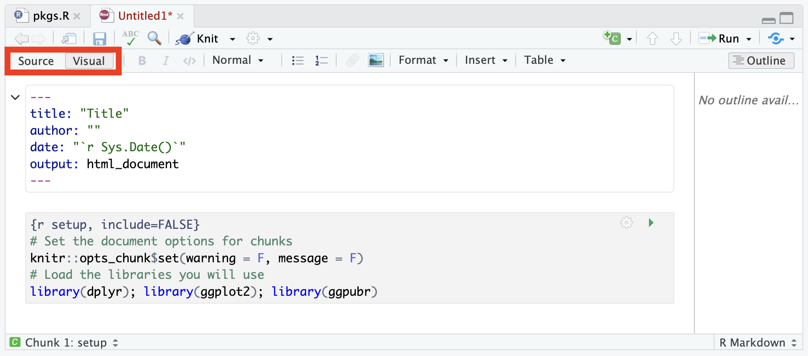
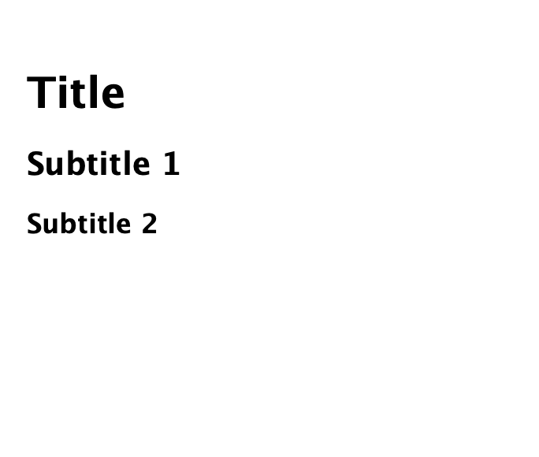

```{r setup, include=FALSE}
knitr::opts_chunk$set(warning = F, message = F)
library(dplyr); library(ggplot2); library(ggpubr);library(Pabloverse)
```

<em>
[Switch to English {width="25"}](https://www.spablo-temporal.network/DataViz-workshop/0a_Intro_RstudioMarkdown.html) | [Mudar para Portugues  {width="25"}](https://www.spablo-temporal.network/DataViz-workshop/PT/0a_Intro_RstudioMarkdown.html)
</em>

En esta primera sección no vamos a usar nada de código o la sintaxis usada en R, nos enfocaremos en familiarizarnos con la interfaz de R studio y los tipos de archivos que podemos crear.  
El objetivo de este ejercicio es que, es que al terminar, estemos familiarizados con los siguientes conceptos:  
  
  - Organización de proyecto.
  - Los componentes principales de la interfaz.
  - Archivos que podemos crear en R studio.

# La interfaz de R studio

Al empezar R studio, vamos a poder ver 4 secciones:

1.  **Source** (arriba izquierda), Aquí tendremos nuestro editor de código y otros archivos que trabajemos. Usaremos esta sección para editar y ver nuestros scripts, y algunos otros documentos que usaremos para interactuar con R.
2.  **Consola y Terminal** (abajo izquierda), Aquí es donde el código sera ejecutado. La *Consola* ejecutara el código de R, la *Terminal* otro código para interactuar directamente con tu sistema operativo. Podemos escribir el código directamente en esta sección, pero normalmente usaremos otros archivos como .R o .Rmd para escribir el código y posteriormente enviarlo a la consola. 
3.  **Environment, History y otros** (arriba derecha), El *environment* nos muestra una lista de todos los objectos que hemos creado durante la sesión, mientras que el historial (*history*) nos muestra el código que hemos enviado a la consola. Existen otras pestañas en esta sección, pero no las usaremos por ahora.
4.  **Files, Packages and Help** (abajo derecha). Esta sección incluye un explorador de archivos *Files*, y otras pestañas para administrar los paquetes.


# Organizacion del proyecto. 

Una de los principales ventajas de R studio es que nos permite organizar nuestros proyectos. Si aun no lo has hecho, te recomiendo que te familiarices con el uso de proyectos en R studio para organizar tu flujo de trabajo. Los proyectos son archivos que contienen la información de tu sesión de R actual, incluyendo objetos, conjuntos de datos y configuraciones, así como los archivos y directorios asociados.  
Al empezar R studio por primera vez, veras un proyecto vacío. Para crear un nuevo provecto, ve al menú de la parte superior derecha y selecciona *New Project...*


Después, te dará la opción de crear un nuevo proyecto en un directorio nuevo, un directorio existente, o por medio de control de versión. Para hoy, no hablaremos de control de versión, pero es una manera muy útil de integrar [Github](https://github.com) con R studio.  


Una vez seleccionada la opcion deseada, te mostrara múltiples opciones para diferentes tipos de proyectos. De estas opciones, selecciona *New project* y haz click en continuar.


Ahora nombra tu directorio y selecciona una ubicacion en tu ordenador.  


Una vez que hayas creado tu proyecto, veras que automáticamente se crearon archivos asociados para tu proyecto en el folder seleccionado. La organización del proyecto depende en tus preferencias personales, pero para darte un ejemplo, yo suelo crear 3 directorios (code, data y docs) para organizar mis archivos asociados al proyecto actual.  


# Editores en R studio

## R scripts (.R)

Ahora vamos a abrir nuestro primer script de R. En el [folder compartido](https://ucdavis.box.com/s/y1p2brjqxkkwr01krz3lrgb3q3yxa7a0) encontraras un script de R en el directorio `Code/pkgs.R`, descarga el archivo e impártalo a tu proyecto de R. Para esto, ve al panel de archivos y selecciona la opción de *upload*. 

{width="100%"}

Una ventana aparecerá con algunas opciones, selecciona la opción *Choose file* y localiza el archivo descargado en tu computadora.  

{width="30%"}

Ahora que ya hemos descargado el archivo, ábrelo y corre el scrip haciendo click en el botón de *Source*. Este script instalara algunos de los paquetes que usaremos en el workshop.

{width="100%"}

Los *R scripts* son los tipos de archivos mas comúnmente usados para programar en R. Existen otros tipos de archivos que nos facilitaran crear documentos de una manera mas amigable.  

## Introduccion a Markdown

{style="float:right" width="16%"}

En R studio podemos editar diferentes tipos de documentos, incluyendo: scripts de R (.R), Markdown (.md y .Rmd), scripts de python (.py), entre otros. Para crear un documento nuevo, podemos ir al menú ubicado en la esquina superior izquierda. Este menú nos mostrara varios tipos de documentos que podemos crear en R studio, para hoy, seleccionaremos la opción *R Markdown...*. Los documentos markdown son documentos editables que pueden incluir secciones de codigo y de texto, y pueden ser renderizados a diferentes formatos como html, word o pdf, ya hablaremos mas adelante de esto en detalle. Esto es muy util para generar reportes que integren de manera mas directa nuestro trabajo con el código y la documentacion.   

Si es la primera vez que usas markdown, te pedirá que instales algunas librerías (todo desde R). Una vez instaladas, te mostrara una ventana con varias opciones para crear tu documento. Nosotros usaremos una plantilla (template), para eso ve al menú izquierdo y selecciona la opción que dice *from template*.  


Si instalaste adecuadamente los paquetes de la sección anterior mediante el archivo pkgs.R, veras una plantilla llamada *blank* de la librería `STNet`. Esta es una plantilla para iniciar un documento vacío, puedes seleccionar esta platilla y dar click en ok. 


## Documentos con R Markdown (.Rmd)

En la sección anterior hemos creado nuestro primer documento con R Markdown, y deberás de ver algo similar:


Este documento contiene un encabezado y un 'chunk' de código (ya hablaremos sobre esto después). Agrega un titulo en el documento, e introduce tu nombre en el espacio para el autor. El documento Rmd usa una sintaxis llamada *Markdown*, la cual no cubriremos a detalle por ahora, pero puedes encontrar mas información en el [este link](https://www.rstudio.com/wp-content/uploads/2015/02/rmarkdown-cheatsheet.pdf). Puedes editar tu documento con la sintaxis de markdown, pero existe también una manera de editar el documento de una manera mas intuitiva y amigable. Para cambiar al editor visual, solo haz click en la opción superior izquierda del documento que creaste, cambiándolo de *Source* a *Visual*. Veras que aparece una barra de herramientas muy parecida a la que encuentras en otros editores de texto.



Podemos agregar nuevas secciones del documento, para esto podemos empezar con un subtitulo. Los títulos tienen una estructura jerárquica similar a la que encontramos en otros editores de texto (p. ej. titulo, subtitulo 1, subtitulo2, etc..). Para definir un nuevo titulo usamos el carácter `#` al iniciar la linea de texto. El numero de `#` indicara el nivel de jerarquía, siendo 1 la mas importante, y números subsecuentes de `#` representan el nivel. Por ejemplo, si escribimos esto:

```         
# Title 1

## Subtitle 1

### Subtitle 2
```

En nuestro editor visual y el documento rendereado, veremos algo así:  



### Navegando el documento

Agregar secciones definidas en nuestro documento nos servirá para poder encontrar mas facilmente la informacion y brincar entre secciones. Existen dos maneras de navegar entre las secciones de nuestro documento: la barra de *outline* derecha, y el menu inferior de *outline*. Si tu barra de *outline* derecha esta colapsada, solo haz click en el icono  {width="10%"}


Si examinas la *outline* inferior, veras que existen algunas secciones adicionales llamadas *chunks*. Un *chunk* se refiere a una sección de codigo en nuestro documento. Esta sección de codigo se ejecutara cada vez que renderizemos el documento (a menos que se especifique lo contrario). Cada documento es independiente de lo que hagamos en la sesión, asi que todos los objetos, funciones y librerías que se usen en el documento deben ser declarados para renderizar el documento correctamente.

### Renderizando el documento.

El proceso de renderizado consiste en generar un archivo en otro formato (html, pdf, word, etc...). Ahora que tenemos nuestro documento Rmd abierto, vamos a probar algunas opciones de renderizado. Para renderizar el documento, puedes hacer click en el icono *knit* {width="10%"} que se encuentra en la barra superior del documento, o usar el atajo `ctrl+shift+k`. EL formato por default de renderizado es html, pero puedes escoger diferentes formatos usando el menu dropdown.


## [Ejercicio 1]{style="color: darkred;"}

Agrega una nueva sección en tu documento escribiendo una biografía corta (área de investigación, intereses, actual trabajo). Si tienes recomendaciones de alguna canción que no puedas dejar de escuchar, o tu comida favorita siéntete libre de incluirlas en una seccion!. Prueba los diferentes modes de renderizacion (pdf y word), guardalo como *exercise1_yourName* y subelo en la siguiente seccion o [este link](https://ucdavis.app.box.com/f/821be3f5e59b4924ac20ea639246cc31).

<iframe src="https://ucdavis.app.box.com/f/821be3f5e59b4924ac20ea639246cc31" height="200" width="800"></iframe>

------------------------------------------------------------------------

*This lab has been developed with contributions from: [Jose Pablo Gomez-Vazquez](https://www.spablo-temporal.network).\
Feel free to use these training materials for your own research and teaching. When using the materials we would appreciate using the proper credits. If you would be interested in a training session, please contact: [jpgo\@ucdavis.edu](mailto:jpgo@ucdavis.edu){.email}*

------------------------------------------------------------------------
