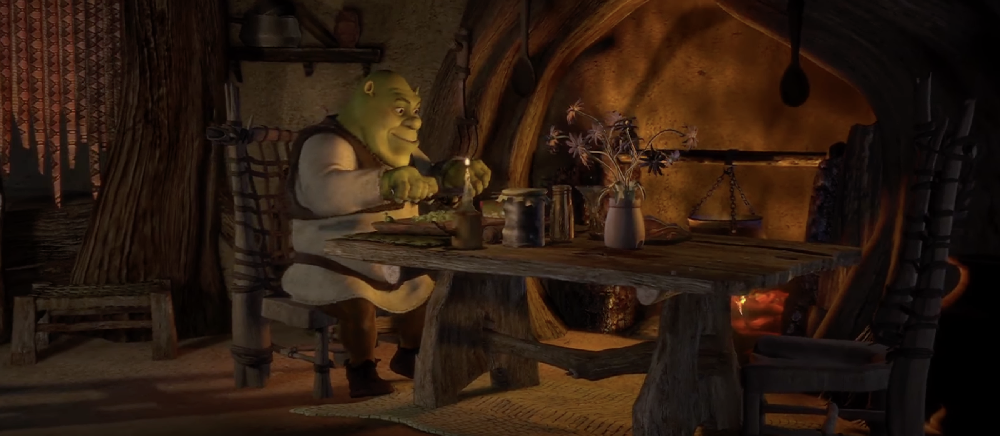

```{r setup, include=FALSE}
knitr::opts_chunk$set(warning = F, message = F)
library(dplyr); library(ggplot2); library(ggpubr);library(Pabloverse)
```




Hora de ir a la comida ... 

------------------

[Inicio](index.html)