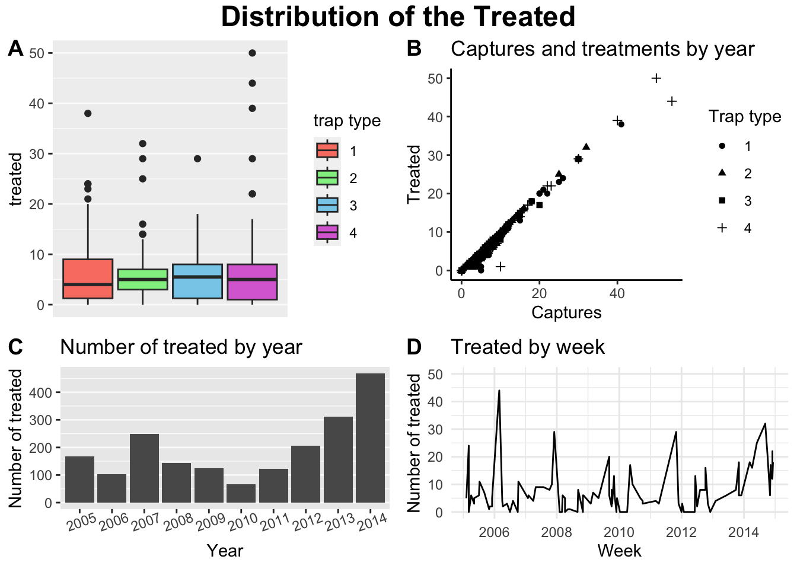

<em>
[Switch to English {width="25"}](https://www.spablo-temporal.network/DataViz-workshop/) | [Mudar para Portugues  {width="25"}](https://www.spablo-temporal.network/DataViz-workshop/)
</em>

```{r setup, include=FALSE}
# Set the document options for chunks
knitr::opts_chunk$set(warning = F, message = F)
# Load the libraries you will use
library(dplyr); library(ggplot2); library(ggpubr)
library(kableExtra)
```

En este curso aprenderas los basicos sobre visualizacion de datos. Usaremos R y la libreria `ggplot2` para explorar differentes aproximaciones para comunicar resultados mediante apoyos visuales. El objetivo de este curso es que al finalizar, los participantes puedan hacer sus propias figuras como este ejemplo:

<center>
{width="60%"}
</center>


# Requisitos

Este workshop asume que los participantes tienen un entendimiento basico sobre la syntaxis del lenguaje de programacion R. Materiales pre-workshop *opcionales* se encuentran disponibles para familiarizar a los participantes con los conceptos basicos que asumiremos los participantes estan familiarizados al empezar el workshop.
  
  - [Intro to R](https://www.spablo-temporal.network/DataViz-workshop/ES/0a_Intro_RstudioMarkdown.html)
  - [Basic R syntax](https://www.spablo-temporal.network/DataViz-workshop/0b_RandTidyverse.html)

Para participar en el curso es necesario contar con las siquientes herramientas:
  
  - Computadora
  - Cuenta de posit.cloud o tener instalado R y R Studio
  
# Registro

Para registrarse al curso, use este enlace: https://docs.google.com/forms/u/1/d/e/1FAIpQLSfXtdQ6ZMFr6sgZVfTRVY8M32UxJy288-P5cUSNYa6IVILMtQ/viewform
 
--------

# Horario tentativo

```{r echo=FALSE}
data.frame(
  Time = c('', '9:00-9:30', '9:30-10:20', '10:20-10:30', '10:30-11:30', '11:30-12:15', '12:15-13:00', '13:00-14:00'),
  D01 = cell_spec(
    c('Tema', 'Introduccion al curso', 'Visualizacion de datos con ggplot', 'Break', 'Mas opciones de personalizacion', 'Lunch', 'Arreglos de figuras', 'Mas allá de visualizaciones estáticas'), 'html',
    link = c('https://www.spablo-temporal.network/DataViz-workshop/slides.html#/title-slide', 'https://www.spablo-temporal.network/DataViz-workshop/slides.html#/title-slide', 'DataViz_I.html', 'coffeeBreak.html', 'DataViz_II.html', 'Lunch.html', 'DataViz_III.html', 'DataViz_IV.html')
  )
) %>%
  kbl("html", escape = FALSE, col.names = c('', 'June 10, 2023')) %>%
  kable_paper(full_width = T, lightable_options = c('hover')) %>%
  column_spec(1, bold = T, border_right = T) %>%
  row_spec(1, bold = T, extra_css = "border-bottom: 1px solid") %>%
  row_spec(c(4,6), background = "#F6F5FA", italic = T)
```

----
