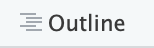
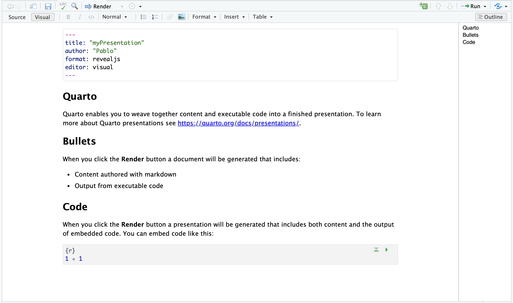
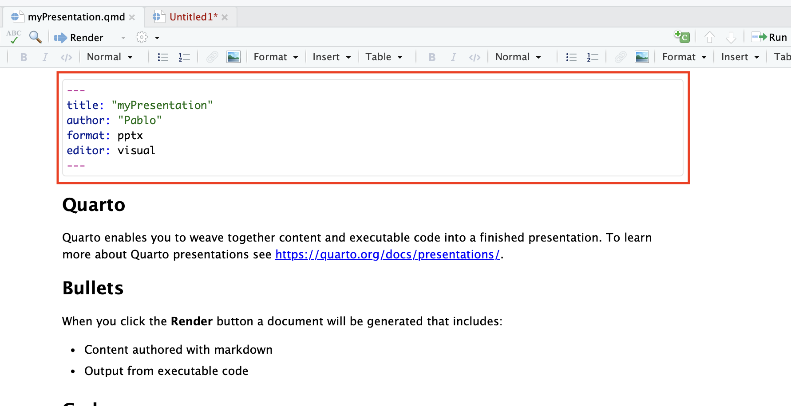

```{r setup, include=FALSE}
knitr::opts_chunk$set(warning = F, message = F)
library(dplyr); library(ggplot2); library(ggpubr) 
#library(Pabloverse)
```

<em>
[Switch to English {width="25"}](https://www.spablo-temporal.network/DataViz-workshop/) | [Cambiar a español  {width="25"}](https://www.spablo-temporal.network/DataViz-workshop/ES/index.html)
</em>

Nesta primeira seção nós não vamos nos preocupar com a programação e a sintaxe utilizadas no R. Nós vamos focar em nos familiarizar com a interface do Rstudio e com os tipos de arquivos que podemos criar nela.

O objetivo dessa prática é que você se sinta mais confortável com os seguintes conceitos:

-   Organização de projetos.
-   Os principais componentes da interface do Rstudio.
-   Arquivos que você pode criar com o Rstudio.

# A interface do Rstudio

Quando nós abrimos o Rstudio, podemos ver 4 seções:

1.  **Source** (acima, à esquerda), aqui podemos ver nosso editor de código e outros arquivos. Nós vamos utilizar essa seção para editar e visualizar nossos scripts e outros documentos que vamos utilizar para interagir com o R.
2.  **Console e Terminal** (abaixo, à esquerda), aqui é onde o código é executado (*Console* vai executar o código R e *Terminal* outros códigos do seu sistema operacional). Nós podemos escrever códigos diretamente aqui, mas normalmente nós vamos usar outros arquivos fonte (source) como por exemplo arquivos .R ou .Rmd para escrever nosso código que então será executado aqui.\
3.  **Environment, History and others** (acima, à direita), Environment (ambiente) lista todos os objetos que você cria. History (histórico) mostra todo o código que foi executado no Console. Existem outras abas nessa seção mas não utilizaremos elas por enquanto.
4.  **Files, Packages and Help** (abaixo, à direita). Esta seção inclui um navegador de arquivos (Files), uma aba para gerenciamento de pacotes (Packages), a ajuda do R (Help), e outras.


# Organizando seus projetos

Uma das capacidades mais úteis do Rstudio é a organização de projetos. Se você ainda não fez, eu recomendo fortemente que você se familiarize com criação e utilização de projetos para organizar o seu fluxo de trabalho. Projetos permitem que você crie um arquivo que conterá toda a informação sobre sua seção (incluindo objetos, conjuntos de dados e configurações) e organizar seus arquivos em pastas no seu computador. Isso é particularmente útil se você está trabalhando com muitos assuntos.\
Quando você abre o Rstudio pela primeira vez ele inicia sem um projeto. Para criar um projeto novo, basta it no menu no canto superior direito e selecionar *New Project...*


Em seguida, você terá a opção de criar um novo projeto em um novo diretório, em um diretório existente, ou usar controle de versão. Por enquanto, nós não iremos abordar o controle de versão em detalhes, pois ele se refere à integração do Rstudio com sistemas de controle de versão como o Git, que está além do escopo deste tutorial. Então, selecione *New Directory* para criar um novo diretório para o seu projeto e clique em Next.


Na próxima tela, você pode escolher o tipo de projeto que deseja criar. Vamos selecionar *New project* para começar com um novo projeto.


Em seguida, você deve fornecer um nome e um local para o seu projeto. Clique em *Create Project* para finalizar a criação do projeto.


Depois de criar o projeto, você verá que o Rstudio é atualizado e a interface agora mostra o diretório do projeto no painel de navegação de arquivos. A partir de agora, todos os arquivos que você criar ou importar serão salvos dentro deste diretório, mantendo seu trabalho organizado. A organização de projetos depende suas preferências pessoais, mas eu normalmente uso 3 pastas (codigo, dados e documentos) para organizar meus arquivos relacionados com o presente projeto.


# Editores no Rstudio

## Scripts do R (.R)

Vamos abrir nosso primeiro script do R. Na [pasta compartilhada](https://ucdavis.box.com/s/ztydby6t65nil1oh8elhnogdjisrwgcc), você encontrará um script do R em `Code/pkgs.R`, faça o download para o seu computador e importe-o para o nosso projeto do R. Vá para a aba de arquivos localizada no painel inferior direito e clique no botão de upload:

{width="100%"}

Uma caixa de diálogo será aberta com algumas opções, clique na opção *Choose file* e localize o script que você baixou em seu computador.

{width="30%"}

Agora que você fez o upload do arquivo para o seu projeto, abra-o e execute o script clicando no botão *Source*. Isso irá instalar algumas bibliotecas que usaremos durante o workshop.

{width="100%"}

Scripts do R são o tipo mais comum de arquivo usado pelo software R, mas existem outros tipos de arquivos que facilitarão a geração de documentos.

## Introdução ao Markdown

{style="float:right" width="16%"}
O RStudio pode criar vários tipos de documentos, incluindo: scripts do R, arquivos de texto, Markdown, entre outros. Para criar um novo documento, você pode ir ao menu localizado no canto superior esquerdo.

Um menu será exibido com todos os diferentes tipos de documentos que você pode criar. Por enquanto, vamos selecionar a opção *R Markdown...*.

Pode ser que ele peça para instalar uma biblioteca se ela ainda não estiver instalada, então clique em "Sim" se isso acontecer. Isso abrirá uma janela onde será solicitado um título, autor e data. Vamos ao menu lateral esquerdo e selecionar a opção de modelo.


Se você instalou corretamente as bibliotecas do script pkgs.R na etapa anterior, você verá um modelo chamado *blank* da biblioteca `STNet`. Este é apenas um modelo vazio que criei. Selecione o modelo e clique em "Ok".


## Documentos com R Markdown (.Rmd)

Criamos nosso primeiro documento com R Markdown, que ficará assim:


O documento já possui o cabeçalho e um bloco de código ou "chunk" (falaremos mais sobre isso posteriormente). Adicione um título para o documento e coloque seu nome no campo do autor. Os documentos Rmd usam uma sintaxe chamada markdown, que não abordaremos em detalhes aqui, mas você pode encontrar mais informações neste [link](https://www.rstudio.com/wp-content/uploads/2015/02/rmarkdown-cheatsheet.pdf). Você pode editar o documento diretamente com a sintaxe Rmd, mas se preferir economizar tempo e não ter que aprender tudo do zero, há uma opção para editar o documento de uma maneira mais familiar. Para fazer isso, basta mudar a opção localizada no canto superior direito do documento de *Source* para *Visual*. Você notará que uma barra de ferramentas com alguns ícones familiares apareceu no topo.


## Adicionando uma nova seção

Para adicionar uma nova seção ao documento, você pode começar com um título. Os títulos podem ser hierárquicos, semelhantes ao que estamos acostumados em outros editores de texto (Título, Subtítulo 1, Subtítulo 2, etc...). Para definir um novo título, usamos o caractere `#` antes do texto, e o número de `#` antes do texto determinará o nível hierárquico. Por exemplo, se quisermos definir uma hierarquia de títulos, escrevemos:

```         
# Título 1

## Subtítulo 1

### Subtítulo 2
```

O resultado visual e renderizado do nosso documento será assim:


### Explorando o documento

Ter seções definidas em nosso documento é útil porque podemos pular rapidamente entre elas. Existem duas maneiras de navegar rapidamente entre as seções: a *barra de navegação à direita* e o *menu de navegação inferior*. Se a sua barra de navegação à direita estiver recolhida, certifique-se de clicar no ícone de navegação {width="10%"}


Você notará que o menu de navegação inferior tem algumas seções extras marcadas como *Chunk*. Um "chunk" se refere a um trecho de código no documento. Esse trecho de código será executado (a menos que você especifique o contrário) sempre que o documento for renderizado. Cada documento é autocontido, o que significa que todos os objetos e funções que você usar devem ser declarados e carregados para que o documento seja renderizado corretamente (falaremos mais sobre isso posteriormente).

### Renderizando o documento

Agora que temos um documento, vamos renderizá-lo em diferentes formatos. Para renderizar o documento, você pode clicar no ícone *knit* {width="10%"}, ou usar o atalho `ctrl+shift+k`. O formato padrão em que o documento será renderizado é HTML, mas você pode escolher diferentes formatos no menu suspenso.


## [Exercício 1]{style="color: darkred;"}

Adicione uma nova seção ao seu documento com uma breve biografia sobre você (formação acadêmica e interesses de pesquisa) e inclua sua música e/ou comida favorita. Experimente os diferentes modos de renderização (pdf e word), salve-o como *exercicio1_seuNome* e envie o documento na caixa abaixo OU [neste link](https://ucdavis.app.box.com/f/821be3f5e59b4924ac20ea639246cc31).

<iframe src="https://ucdavis.app.box.com/f/821be3f5e59b4924ac20ea639246cc31" height="200" width="800"></iframe>

## Apresentações com quarto

Como você viu, o Rstudio pode ser usado para mais do que apenas programação. O Rstudio pode ser usado como uma alternativa gratuita aos editores de texto, o que nos permite gerar diferentes tipos de documentos, como relatórios. Mas espere... há mais coisas que podemos fazer com o Rstudio. Na próxima seção, vamos introduzir brevemente como usar o Rstudio para gerar apresentações, semelhantes ao que você pode conseguir com o PowerPoint.

Quarto é uma plataforma para criar apresentações usando uma abordagem muito similar ao R Markdown. Para criar uma apresentação no quarto, você pode usar o mesmo menu que usou anteriormente para criar um novo documento.


Sua apresentação já terá algum texto baseado no modelo padrão e terá uma aparência semelhante a esta:



Assim como nos documentos do R Markdown, você pode renderizar a apresentação em vários formatos. O formato padrão usa HTML, mas você também pode renderizar em PDF e PowerPoint. Se você deseja renderizar em outros formatos, pode especificar isso ao criar o documento ou alterar no cabeçalho YAML:

Para powerpoint:



Para pdf:


Não vamos abordar em detalhes como ir além da formatação das apresentações, mas aqui estão alguns exemplos para você ver o escopo:

-   <https://runapp2022.talks.jamesgoldie.dev/#/james-goldie>
-   <https://emilhvitfeldt.github.io/useR2022-textrecipes/#/section-8>

<https://github.com/mcanouil/awesome-quarto#real-life-examples>

------------------------------------------------------------------------

*This lab has been developed with contributions from: [Jose Pablo Gomez-Vazquez](https://www.spablo-temporal.network).\
Sinta-se à vontade para usar esses materiais de treinamento para sua própria pesquisa e ensino. Ao usar os materiais, agradecemos o devido crédito. Se você estiver interessado em uma sessão de treinamento, entre em contato: [jpgo\@ucdavis.edu](mailto:jpgo@ucdavis.edu){.email}*

------------------------------------------------------------------------
