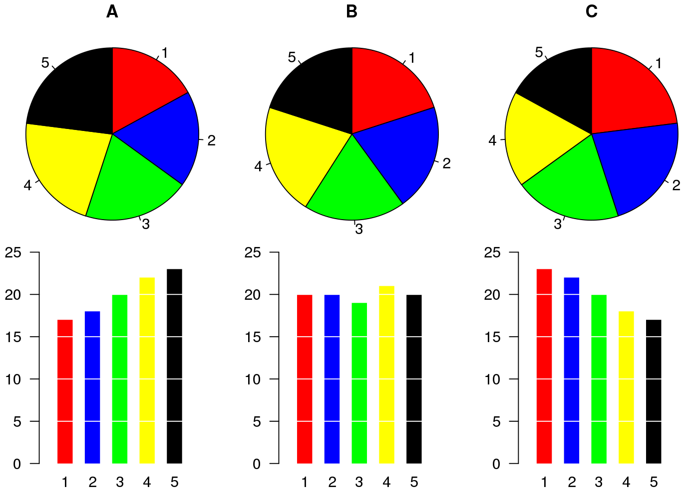

<em>
[Switch to English {width="25"}](https://www.spablo-temporal.network/DataViz-workshop/DataViz_I.html) | [Cambiar a español  {width="25"}](https://www.spablo-temporal.network/DataViz-workshop/ES/DataViz_I.html)
</em>

```{r setup, include=FALSE}
knitr::opts_chunk$set(warning = F, message = F)
```

```{r load libraries and data}
# Carregar os pacotes
library(ggplot2) # para gráficos
library(dplyr) # Para manipulação de dados
library(STNet) # biblioteca com conjuntos de dados

# carregando dados do pacote
data('captures') # carregamos os dados
head(captures) # vamos dar uma olhada nos dados
```

# Gráficos no R

Por padrão, o R já possui um conjunto de funções para criar uma variedade de gráficos, mas o código pode se tornar bastante complexo e difícil de ler à medida que produzimos gráficos mais detalhados. O `ggplot2` é uma biblioteca que fornece um conjunto de funções para produzir uma variedade de gráficos.

A função `ggplot()` deve ser chamada no início da definição do gráfico, essa função cria um espaço em branco para o nosso gráfico. Se chamarmos a função sem argumentos, veremos apenas o espaço em branco, por exemplo:

```{r blank canvas}
ggplot()
```

Em seguida, podemos adicionar camadas ao nosso espaço em branco com base nos dados que queremos visualizar, de forma semelhante aos pipes, conectaremos as diferentes camadas do nosso gráfico com o operador `+`.

Os componentes básicos que precisamos definir para um gráfico são os seguintes:

-   *data*, o conjunto de dados que usaremos para gerar o gráfico
-   *geometry*, ou tipo de gráfico que geraremos (por exemplo: histograma, barra, dispersão, etc.)
-   *aesthetic*, variáveis ou argumentos que serão usados para o gráfico, por exemplo: localização, cor, tamanho, etc.

Um exemplo:

```{r hist example}
ggplot(data = captures) + # Este é o conjunto de dados que usaremos
  geom_histogram( # Este é o tipo de gráfico (geometry)
    aes(x = treated) # (geometry) Neste caso inclui apenas uma variável representando o eixo x
  )
```

Outros componentes dos gráficos podem ser definidos para personalizar ainda mais nossas figuras, e abordaremos esses detalhes mais adiante.\
Como você observou no exemplo anterior, podemos visualizar os gráficos diretamente no console do R, mas uma maneira que gosto de organizar os gráficos é colocá-los todos dentro de um único objeto no R. Esse objeto pode ser uma `list`, que é apenas um contêiner para outros objetos.

```{r create fig list}
# Para criar uma lista vazia, podemos usar a função list()
figures <- list()
```

# Visualizando distribuições

## Variáveis contínuas

### Histogramas

A forma mais simples de visualizar a distribuição de uma variável contínua é usando um histograma. Histogramas são um tipo especial de gráfico de barras onde nossa variável é agrupada em canais (bins) e mostrando as contagens para cada canal. Agora que temos nosso contêiner de listas para os gráficos, podemos simplesmente salvá-lo lá e atribuir um nome que desejamos.

Observe que vamos combinar os pipes com a sintaxe do ggplot. Você pode definir o nome dos dados na função ggplot ou antes da função e conectá-lo com um pipe.

```{r hist}
figures$histogram <- captures %>% # Estes são os dados que usamos.
  ggplot() + # Definimos o espaço em branco
  geom_histogram(aes(x = treated)) # adicionamos uma camada para visualizar um histograma

# Podemos ver nosso gráfico chamando o nome em nosso contêiner de listas
figures$histogram
```

### Boxplots

Boxplots são ótimos para mostrar a distribuição de uma variável contínua. Podemos usá-lo para mostrar apenas uma variável ou várias variáveis. É importante produzir gráficos com boa descrição, a ideia de um gráfico é que ele possa se explicar sozinho. Vamos começar a introduzir lentamente funções para fazer isso e personalizar nossos gráficos.

```{r boxplot}
# Only one variable
figures$box <- captures %>% 
  ggplot() +
  geom_boxplot(aes(y = treated))

figures$box
```
## Variáveis categóricas

### Gráficos de Pizza... ?

Gráficos de pizza não são tão diretos no ggplot, não existe uma função geom_pie. Para fazer isso, você pode essencialmente fazer um gráfico de barras com algumas especificações e depois usar a função `coord_polar()`, que converterá as coordenadas da figura.

```{r pie chart with ggplot}
captures %>% count(municipality) %>% 
  ggplot() +
  geom_bar(aes(x = 'municipality', y = n, fill = municipality), stat = 'identity') +
  coord_polar('y') +
  theme_void()
```

Você pode estar se perguntando por que não há geom_pie no ggplot... Apesar de os gráficos de pizza serem um dos gráficos mais comuns na mídia para dados categóricos, eles têm sido criticados por serem difíceis de interpretar ao analisar distribuições, especialmente quando a distribuição da variável é uniforme. Você pode avaliar isso por si mesmo na figura a seguir:

{width="70%"}

Algumas alternativas aos gráficos de pizza incluem gráficos de mosaico e de barras.

## Mosaico

A principal desvantagem dos gráficos de mosaico é que não há uma função específica na biblioteca `ggplot2` para criar esse tipo de gráfico, o que significa que ele não se integra tão bem com algumas das funções que usaremos neste workshop. Podemos usar outra biblioteca (`treemap`) para gerar esse gráfico. Usaremos a função `treemap()` da mesma biblioteca:

```{r}
library(treemap) # carregar a biblioteca

captures %>% # Esses são nossos dados
  count(municipality, captures) %>% # contamos o número de capturas
  treemap(
    ., #Declara nossos dados como o resultado da linha anterior
    index = 'municipality', # A variável índice
    vSize = 'n' # Variável que indica a frequência por categoria
  )

captures %>% # this is our data
  count(municipality, captures) %>% # we count the number of captures
  treemap(
    ., # This is our data
    index = 'municipality', # The index variable
    vSize = 'n' # Variable that indicates the frequency per category
  )
```

Treemaps (ou mosaicos) podem incluir várias hierarquias

```{r}
captures %>% 
  count(municipality, location, captures) %>% 
  treemap(., index = c('municipality', 'location'), vSize = 'n')
```

## Gráficos de barras

Gráficos de barras são ótimos para representar frequências de categorias. No exemplo a seguir, contaremos o número de tratamentos por ano e, em seguida, visualizaremos em um gráfico de barras.

```{r barplots}
figures$bars <- captures %>% 
  count(municipality) %>% 
  ggplot() +
  geom_bar(aes(
    x = n, # Eixo X
    y = municipality # Eixo Y
  ), stat = 'identity') # Tipo de gráfico de barras

figures$bars
```

Podemos adicionar variáveis extras para indicar a composição (usando outra variável) de cada uma das categorias em nossos gráficos. Por exemplo, adicionaremos a variável *trap_type* para colorir as barras nesse gráfico. Para fazer isso, adicionamos o argumento `fill = factor(trap_type)` à nossa função `aes()`.

```{r}
figures$bars <- captures %>% 
  count(municipality, trap_type) %>% 
  ggplot() +
  geom_bar(aes(
    y = municipality, # Eixo Y
    x = n, # Eixo X
    fill = factor(trap_type) # Variável usada para preenchimento
  ), stat = 'identity') # tipo de gráfico de barras

figures$bars
```

Existem diferentes estratégias para visualizar isso, outro exemplo seria dividir a composição em barras individuais, como no seguinte gráfico. Isso pode ser útil para comparar a composição dentro do grupo:

```{r}
captures %>% 
  count(municipality, trap_type) %>% 
  ggplot() +
  geom_bar(aes(
    y = municipality,
    x = n,
    fill = factor(trap_type)
  ), stat = 'identity', position = 'dodge') # tipo de gráfico de barras
```

Outra opção é visualizar a composição como uma proporção, adicionando o argumento `position = 'fill'` à função `geom_bar()`. Observe que isso remove o sentido do número de observações para a categoria principal (*year*):

```{r}
captures %>% 
  count(municipality, trap_type) %>% 
  ggplot() +
  geom_bar(aes(
    y = municipality, 
    x = n, 
    fill = factor(trap_type)
  ), stat = 'identity',
  position = 'fill') # tipo de gráfico de barras
```

# Visualizando relações entre variáveis

## Gráficos de dispersão

Este é um dos tipos mais populares de gráficos, útil para representar a relação entre duas variáveis contínuas.

```{r}
figures$scatter <- captures %>% # primeiro começamos com o nome do nosso data.frame
  ggplot() + # em seguida, configuramos a tela (ou canvas)
  geom_point(aes(x = treated, y = captures)) # e adicionamos uma camada de pontos

figures$scatter
```

## Mapas de Calor

Mapas de calor (ou *heatmaps*) representam a frequência (ou outros valores) para uma combinação de variáveis em uma matriz. Por exemplo, podemos visualizar a frequência de capturas por tipo de armadilha para cada um dos municípios em nossos dados:


```{r}
figures$heatmap <- captures %>% # Dados que estamos utilizando
  count(municipality, trap_type) %>% # Contagem por municipio e tipo de armadilha
  ggplot() +
  geom_tile(aes(
    y = municipality, # eixo y 
    x = factor(trap_type), # eixo x
    fill = n # Preenchimento para cada célula
  ))

figures$heatmap
```

## Boxplots (novamente...)

```{r}
# Apenas uma variável
figures$box <- captures %>% 
  ggplot() +
  geom_boxplot(aes(x = treated, y = municipality))

figures$box
```

# Séries temporais

Para criar uma série temporal, precisamos reformatar um pouco os dados para que o R possa fazer o que queremos. Vamos introduzir um novo tipo de variável: `date`. A variável de data é basicamente o que parece, é uma variável que tem um formato com ano, mês e dia; existem outras formas de formatar datas no R, mas esta é a mais comum e direta.

```{r}
tCaptures <- captures %>% 
  mutate(date = as.Date(date, "%d/%m/%y"), # Primeiro, formataremos a data
         month = lubridate::floor_date(date, 'month')) %>%  #  Em seguida, criaremos uma variável formatando a data como mês do ano
  count(month) # Contar o número de observações por mês
```

Agora que temos nossas variáveis no formato correto, podemos usá-las como qualquer outra variável.

```{r}
figures$timeseries <- tCaptures %>% 
  ggplot() +
  geom_line(aes(x = month, y = n))

figures$timeseries
```

```{r export objects for next session, include=F}
# Este exemplo funciona, mas todos os objetos são chamados de 'o'
# Veja se é possível chamar os objetos como deveriam
# ls() %>% 
#   lapply(., function(x){
#     o <- eval(parse(text = x))
#     save(o, file = paste0('misc/I/', x, '.RData'))
#   })

# Por enquanto, faça manualmente
# save(captures, file = 'misc/I/captures.RData')
# save(figures, file = 'misc/I/figures.RData')
# save(tCaptures, file = 'misc/I/tCaptures.RData')
```

------------------------------------------------------------------------

*Este laboratório foi desenvolvido com contribuições de: [Jose Pablo Gomez-Vazquez](https://www.spablo-temporal.network) and José Grisi-Filho. \
Sinta-se à vontade para usar estes materiais de treinamento em sua própria pesquisa e ensino. Ao utilizar os materiais, agradecemos que sejam atribuídos os devidos créditos. Se você estiver interessado em uma sessão de treinamento, entre em contato: [jpgo@ucdavis.edu](mailto:jpgo@ucdavis.edu).* 

------------------------------------------------------------------------
