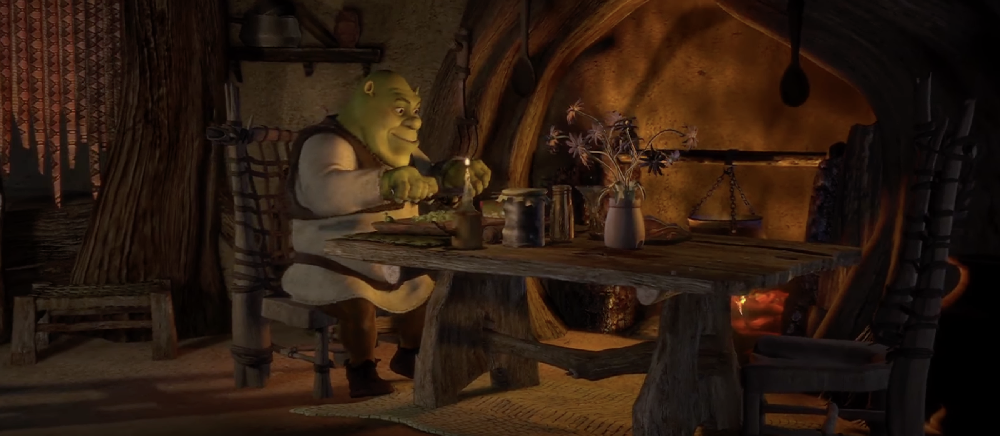

```{r setup, include=FALSE}
knitr::opts_chunk$set(warning = F, message = F)
library(dplyr); library(ggplot2); library(ggpubr);library(Pabloverse)
```




Go eat some food ... 

------------------

[Go Back](index.html)